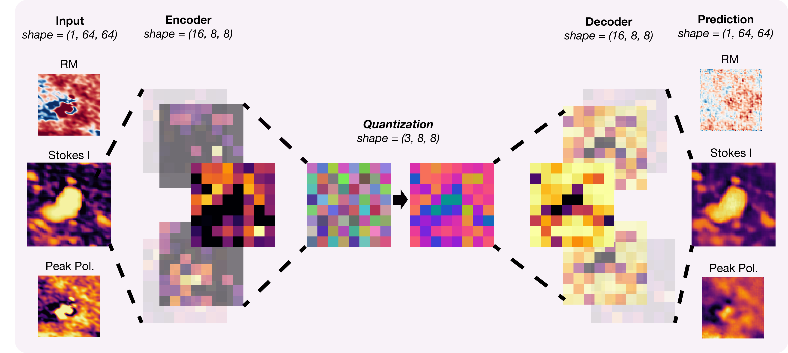
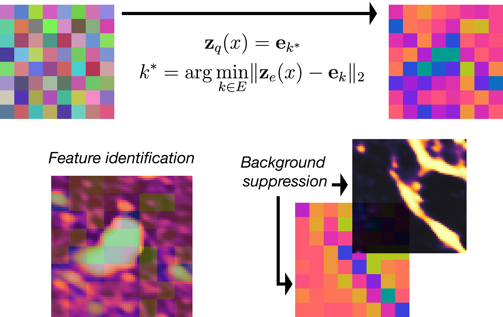

# Polar4M

*A foundational model for POSSUM polarisation data based on the 4M framework.*



## Table of contents
* [Before you begin...](#before-you-begin)
* [Motivation / Problem](#motivation--problem)
* [Methodology](#methodology)
* [Data](#data)
* [Code structure](#code-structure)
* [Warnings](#warnings)
* [Further comments](#further-comments)
  * [Present ideas I have to make a better model](#present-ideas-i-have-to-make-a-better-model)
  * [Extra resources](#extra-resources)
* [Acknowledgments](#acknowledgments)


## Before you begin
This repo represents my work through the summer with 
Erik Osinga, Bryan Gaensler, Mike Walmsey and Joshua Speagle 
developing ML models to understand POSSUM images.
It has been an amazing journey and I could not be more grateful for it.
Therefore, before starting I wanted to say a few words.

ML and astrophysics can sometimes come as different worlds, but
 in my mind they encompass the same topic: pattern identification, or
the seek for knowledge. Particularly, I do not think these two topics
are *fundamentally* different and I find inspiring when physics ideas are used in ML, for example.
In what follows I hope you can also enjoy this view 
by learning from both sides of this project. One is as relevant as
the other and I believe each one offers a unique perspectives on
its counterpart.

When I started, a series of papers were shared to me 
to get familiar with the topic. Here is my own (updated) list:
* [Cosmic magnetism relevance](https://arxiv.org/pdf/2006.03172)
* [Introduction to POSSUM's pilot data](https://arxiv.org/pdf/2403.15668)
* [POSSUM's goals and description](https://arxiv.org/pdf/2505.08272)
* [Introduction to Faraday Rotation](https://ui.adsabs.harvard.edu/abs/2021MNRAS.507.4968F/abstract)
* [A good introduction to autoencoders + applications on astrophysics](https://arxiv.org/pdf/2002.10464)
* [Introduction to transformers](https://arxiv.org/pdf/1706.03762)
* [ASTROCLIP: foundation models in astrophysics](https://arxiv.org/abs/2310.03024)
* [Introduction to VQ-VAE (variational quantizers)](https://arxiv.org/pdf/1711.00937)

I recommend first reading the other sections of the repo to get a better sense
of the project. Later, you might find useful to come back and read the set of 
papers above. The order in which I recommend reading the papers goes from top to
bottom, but feel free to follow any order.


## Motivation / Problem

Polarisation observations allows us to understand the magnetized universe:
- They offer a unique way to probe the magnetic fields at extreme regions, 
like the intergalactic medium or at external galaxies.
- They help to understand the influence of magnetic fields in shaping the evolution
of the universe, e.g. how magnetic fields shape planetary habitability.

However, we do not know yet many basic traits about cosmic magnetic fields, e.g. how
they were firstly originated? 
With it, many other fundamental questions remain unsolved.

On the other side, the Polarisation Sky Survey of the Universe’s Magnetism 
(POSSUM) will offer the possibility to look at more than 1M polarized sources. 
Particularly, its RM grid will be the most powerful ever obtained. With this new information,
we hope to answer many unsolved questions. 

Given time and space constraints, the purpose of this project is to
develop an ML framework that can **understand** this sea of data. Therefore,
picking up outliers and meaningful patterns in the data through which
**new physics** can be derived.


## Methodology

Our model follows a [4M](https://arxiv.org/pdf/2312.06647) framework, click 
[here](https://4m.epfl.ch) to access the official website accompanying the paper. 
The idea is simple, and it is explained by its name, where 4M stands for Massively Multimodal
Masked Modeling. If you are familiar to transformers then you already have an idea
of how it functions. Otherwise, I will explain here.

In transformers, you have a set of input token from which you try to predict a set of 
output tokens. You can train your transformer model in many ways, particularly 
you can train with mask modeling. This one works as follows. First, you would
mask some input tokens. Second, you will ask the transformer to try and predict 
the true value of the masked tokens based on the rest of tokens. 

Massive Multimodal Masked Modeling (4M) takes a similar approach but slightly different.
**From a random subset of input tokens you predict a random subset of output tokens.**

The above implies we can express our data as a sequence (or a set of tokens), 
but how you do that for images? The approaches are diverse and we have picked
VQ-Quantizers. Below, you can find a description of how they work but briefly, 
VQ-Quantizers offer the possibility to express images as sequences. 
For us, this made VQ-Quantizers the best (and natural) choice given transformers
have been created to work with sequences. 

VQ-Quantizers work a lot like eigenvectors. Consider any image (belonging to some 
data distribution) with an arbitrary number of channels $C$ and some shape $(H, W)$.  
The idea of quantizers is that you can choose to represent each pixel on the image
with a fixed number of vectors while not loosing information. As a result, you are discretizing the 
values across each pixel can vary. This is a strong statement. 

Consider the set of images
to be $[0,1]^{C \times H \times W}$. Let $N$ describe the number of vectors through which you can 
describe any pixel on the image and set each vector to be of dimension equal to $D$. Call $S$ 
the set of such vectors. With VQ-Quantizers you can describe an entire image of arbitrary shape
$(C, H, W)$ as a sequence of vectors in $S$. 

The compression goes beyond the dimension of each vector in $S$. Suddenly you can describe the 
whole structure of the image by $H \times W$ numbers.




## Data

The data we have used has been extracted from the POSSUM band 1 pipeline. 
With proper permissions, the data can be accessed at [CANFAR](https://www.canfar.net/en/).

We have focused on understanding three data image modalities. Note that each one of these 
are described as feature maps, meaning their images have only one channel. The modalities
we have worked with are:
1. Peak polarisation
2. Rotation Measure
3. Stokes I

Extra notes: the 4M framework offers an easy way to extend to a bigger number 
of data modalities. The dataset consists as of right now
of 2676 samples. Each sample has the three corresponding feature maps and
in the future we expect to extend the dataset as more data is collected by POSSUM. 
The 2676 samples are all the POSSUM samples collected so far which do not have 
NAN entries on their three corresponding feature maps.

POSSUM offers big tiles of data where several polarisation sources are located.
In consequence, we have made rectangular cuts around each polarisation source.
Then we have worked with those cuts for each sample and modality.
The cuts for each $\text{source}$ were designed to have a square shape of $10\times (\text{source's major axis radius})$. 
Some image data has rather a rectangular shape because they exist on the border of some POSSUM 
tiling. We plan to fix this in our dataset, in spite of that we expect the model to work
quite well given  the number of relative samples does not significantly change.

Finally, with `torchvision` we have resized each 2D cut around the source 
to a 64x64 feature map for each data modality.


## Code structure

- `scripts/run_training.py`
Run the VQ-Quantizer.

- `src`
Code and utilities for the model.
  - `src/data/` - Data handling.
    - `src/data/datasets`- Where to put your datasets.
  - `src/models/` - Model architecture definitions.
  - `src/lightning_modules/` - PyTorch Lightning wrappers of the model.
  - `src/utils/` - Helper functions.
- `notebooks/` - Visualizations.
- `checkpoints/` - Folder to save model checkpoints (automatically created given `settings.py`)
- `hugging_face/` - Folder for easy deploy into hugging face. 
- `requirements.txt` - Dependencies.
- `settings.py` - Unified file path configuration (e.g. `CHECKPOINTS_DIR`).
- `example_train.sh` - Example file to run a SLURM job.


## Installation / Setup
**Dependencies:**  
```bash
pip install -r requirements.txt
```


## Warnings

The model is under construction. We have finished the first part consisting
on data tokenization with VQ-Quantizers. The code for the transformer part
will soon be released as 75% of it is done.


## Further comments

### Present ideas I have to make a better model

- Instead of implementing the VQ-Quantization lookup with a
Euclidean metric, a cosine similarity algorithm might yield better results.
Particularly, I expect the model to learn to relate much better neighboring 
pixels enhancing reconstruction.
- The VQ-Quantizers offer the possibility to represent each pixel on an image 
as one vector of the discrete set of quantizer vectors $S$. This is great in terms 
of compression. In terms of meaning/interpretability not so much. Word2vec showed some interesting properties
of how ML models learn data. In a similar fashion, I think that a way to create better
quantized representation of the data is by expressing each pixel as a linear combination of the
vectors in the set $S$ defined as above. This will allow for vectors to capture "concepts"
in a much more direct way. And it will enforce linearity! 
Desirable for interpretability.
- I am not fully convinced that a 4M framework is the way to best capture 
all the modalities' concepts. It works as a baseline model, but I think it could be improved.
Particularly, I think that new ways of adapting VQ-Quantization (besides those mentioned above)
could bring better results. Email me to talk about it.

### Extra resources
If you want to keep on working in ML, you might find useful the following sites:
* [Anthropic's interpretability team updates](https://transformer-circuits.pub/)
* [Google's Deepmind blog](https://deepmindsafetyresearch.medium.com/)
* [Andrej Karpathy's 101 blogpost on training NN](https://karpathy.github.io/2019/04/25/recipe/)


## Acknowledgments

So far, the code here is an application of the [4M framework](https://github.com/apple/ml-4m/blob/main/README.md) for the polarisation data
coming from POSSUM. 
- **4M: Massively Multimodal Masked Modeling**, NeurIPS 2023 (Spotlight)  
  David Mizrahi*, Roman Bachmann*, Oğuzhan Fatih Kar, Teresa Yeo, Mingfei Gao, Afshin Dehghan, Amir Zamir

- **4M-21: An Any-to-Any Vision Model for Tens of Tasks and Modalities**, NeurIPS 2024  
  Roman Bachmann*, Oğuzhan Fatih Kar*, David Mizrahi*, Ali Garjani, Mingfei Gao, David Griffiths, Jiaming Hu, Afshin Dehghan, Amir Zamir  

Please refer to the papers for further information. In the future, we seek to 
go beyond an application by creating a better quantizer through the ideas highlighted above.
Therefore, extending the model.


*Thank you once more to Erik Osinga, Bryan Gaensler, 
Mike Walmsey and Joshua Speagle for an incredible summer.*


